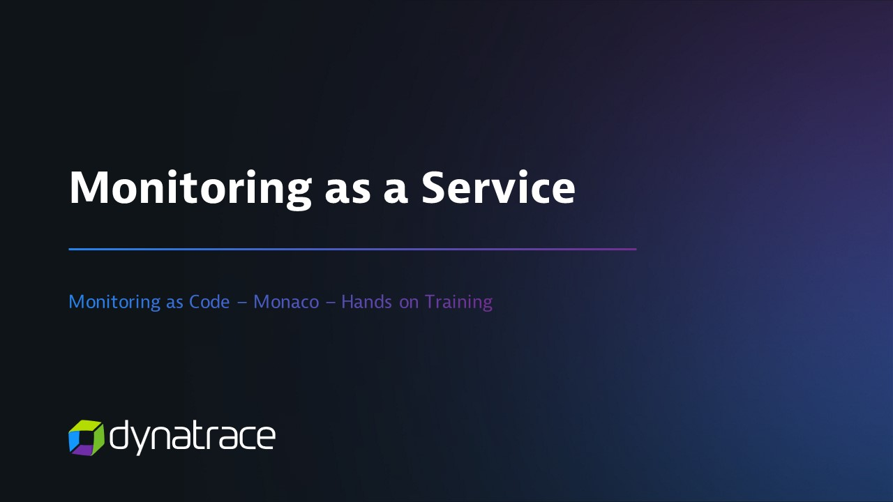

Monaco is a CLI tool that automates the deployment of Dynatrace Observability and Security Configuration to one or multiple Dynatrace environments. It initially started as "Monitoring as Code" - hence the naming Monaco.

## Why Monaco?

Monaco’s self-service model enables development teams to set up observability and security quickly and efficiently, even for large-scale applications. 
It eliminates the need for building custom observability and security solutions and reduces the manual work for your teams.  

The Configuration as Code approach enables you to manage your Dynatrace environment observability and security tasks through configuration files instead of a graphical user interface. 
Configuration files allow you to create, update, and manage your observability and security configurations safely, consistently, and repetitively. They can be reused, versioned, and shared within your team.

## How does it work? 

Developers define a observability and security configuration file and check it into version control alongside the application’s source code.
The code gets built and deployed with the next commit or pull request, automatically creating observability dashboards and alerting notifications.

 

## Features

Monaco currently offers the following features:
- Creating configuration templates for reuse across multiple environments. 
- Handling interdependencies between configurations without needing to keep track of unique identifiers. 
- Applying the same configuration to hundreds of Dynatrace environments and being able to update them all at once. 
- Rolling out specific configurations to specific environments. 
- Promoting application-specific configurations from one environment to another, following deployments in every stage. 
- Supporting all mechanisms and best practices of git-based workflows such as pull requests, merging, and approvals. 
- Commit your configuration to version control and collaborate on changes. 

## Get started

To get started, follow our guide on [how to install Monaco.](installation.md)

## Learn more

To learn more, watch our one-hour deep-dive into Dynatrace Configuration as Code with Monaco:

 
