# Convert

The `monaco convert` command applies automatic conversion rules to help prepare configuration files that were written for Monaco version 1 to be used with Monaco version 2. It produces a yaml manifest file which contains a list of environments and projects.

```
This command is only available in Monaco v2.0 releases
```

Usage: `monaco convert environment-file working-deirectory [flags]`

`monaco convert` changes configuration files in a specified directory. The command takes options that are required. These options include a yaml file containing a list of environments, the name of the manifest file that will be produced, the name of the output folder where the converted configurations will be stored and the name of the folder where the environments file is located.

## Example

```shell
monaco convert environments.yaml  my_example_Working --manifest my_manifest_example --output-folder rootfolder
```

## Convert options

The following options (flags) allow you to run the convert command to change configuration files that were written for Monaco version 1 to a deployment manifest to be used with Monaco version 2.

- `--manifest` - With this option, the name of the manifest file that is produced by the convert command is supplied. (Defaults to manifest.yaml) `-m` can also be used as a shorthand.

- `--output-folder` - This option is used supply the name of the output folder the convert command creates and stores all converted configurations.(Defaults to {project-folder}-v2) `-o` can also be used as a shorthand.

## Demo


