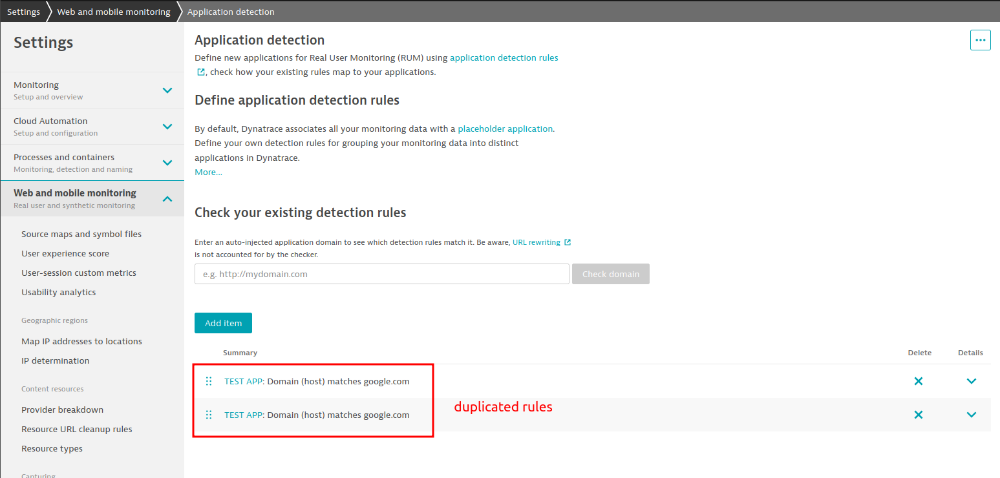

An internal change in how Dynatrace stores application detection rule configurations from version 1.252 upwards
can result in issues with existing monitoring as code configuration.

**As a positive effect of this change, there is no need to use app-detection-rule-v2 as of 1.252 upwards, as the API no longer requires [special handling](/configuration/special_config_types.md#non-unique-name).**

This Guide describes the manual steps required to work around this.

## The issue

While monaco uses the 'name' of a configuration to identify it, an internal migration results in all existing
app-detection-rule being renamed. This results in the first monitoring config deployment creating a new, duplicate configuration.

To check if you're facing this issue, look at the Application Detection rules in the Dynatrace UI or call the API directly.

As a sample, let's assume there is a single app-detection-rule defined via monaco as:

YAML Config: 
```yaml
config:
    - detection_rule: "det.json"

detection_rule:
    - name: "TEST RULE"
    - application_id: "some-project/application-web/my-app.id"
```

JSON Template: 
```json
{
    "name": "{{ .name }}",
    "applicationIdentifier": "{{ .application_id }}",
    "filterConfig": {
        "applicationMatchTarget": "DOMAIN",
        "applicationMatchType": "MATCHES",
        "pattern": "google.com"
    }
}
```

Looking into the Settings UI, where you would expect a single rule, you will see a duplicate after a monitoring config deployment: 



A GET request to the API will have a result looking something like this:
```sh
curl -X GET "{YOUR ENVIRONMENT_URL}/api/config/v1/applicationDetectionRules" -H  "accept: application/json; charset=utf-8" -H  "Authorization: Api-Token {YOUR API TOKEN}"
[...]
{
  "values": [
    {
      "id": "e3348565-01b0-35a3-aae0-8957d5f6c1f2",
      "name": "TEST RULE"
    },
    {
      "id": "a8835418-c7b3-304d-a9f5-6cc08e8935f0",
      "name": "a8835418-c7b3-304d-a9f5-6cc08e8935f0"
    }
  ]
}
```

As you can see, one of these rules has the expected "TEST RULE" name, while the other has a name matching its ID.

Subsequent monitoring config deployments will update the correctly named rule but leave a duplicate of the original rule.

## Solutions

There are two ways to resolve the duplicated rules.

### Easy but with possible monitoring impact

If you can accept a short timeframe in which there are no application detection rules in place, you can: 
1) Delete all duplicate rules from the 'Application detection' Settings page (or via API)
2) Run monaco deploy to re-create the rules

### Safe but requires manual validating and use of the API

If it is not acceptable to have any timeframe without application detection rules in place, you can: 
1) Run monaco deploy
   * This will result in duplicated rules  as described above, or might already be the case
   * Once duplicate rules exist, you can delete the migrated rule (where `id` and `name` are the same) while the correctly named rule stays in place and active
2) Query the API to get all rules
   ```sh
   curl -X GET "{YOUR ENVIRONMENT_URL}/api/config/v1/applicationDetectionRules" -H  "accept: application/json; charset=utf-8" -H  "Authorization: Api-Token {YOUR API TOKEN}"
   ```
3) **If not all of your rules are defined via monitoring configuration as code, check the content of each configuration to identify the duplicates**
   ```sh
   curl -X GET "{YOUR ENVIRONMENT_URL}/api/config/v1/applicationDetectionRules/{A RULE ID}" -H  "accept: application/json; charset=utf-8" -H  "Authorization: Api-Token {YOUR API TOKEN}"
   ```
   * If the content matches one of your rules defined using monaco you can delete it as described below, or else leave it untouched.
   * If all your rules are defined using monaco, you can delete all migrated rules (where `id` and `name` are the same)
4) Delete the migrated duplicate using the API
   ```sh
   curl -X DELETE "{YOUR ENVIRONMENT_URL}/api/config/v1/applicationDetectionRules/{A RULE ID}" -H  "accept: application/json; charset=utf-8" -H  "Authorization: Api-Token {YOUR API TOKEN}"
   ```


